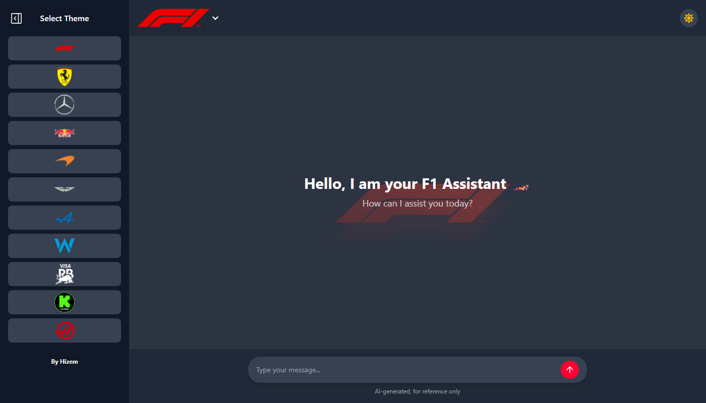

# F1 Chatbot

Ask questions about Formula 1 history in plain English and get conversational answers backed by real data. An LLM translates each question into SQL, the query runs against a database of every Formula 1 season from 1950 to 2024, and the results are turned back into a natural-language answer.



## How it works

```
 "Who won the 2021 championship?"
            │
            ▼
 ┌─────────────────────┐   schema + few-shot    ┌──────────────────────────┐
 │  FastAPI  /ask      │ ─────────────────────▶ │ Llama 3.1 8B (Groq)      │
 │                     │ ◀───────────────────── │ writes a SQL query       │
 │                     │        SELECT ...      └──────────────────────────┘
 │                     │
 │                     │   read-only query      ┌──────────────────────────┐
 │                     │ ─────────────────────▶ │ SQLite F1 database       │
 │                     │ ◀───────────────────── │ 1950–2024, 14 tables     │
 │                     │        rows            └──────────────────────────┘
 │                     │
 │                     │   question + rows      ┌──────────────────────────┐
 │                     │ ─────────────────────▶ │ Llama 3.3 70B (Groq)     │
 │                     │ ◀───────────────────── │ writes the answer        │
 └─────────────────────┘                        └──────────────────────────┘
            │
            ▼
 "Max Verstappen won the 2021 Drivers' Championship 🏆"
```

1. **Text-to-SQL**: a small, fast model receives the database schema ([`backend/schema.md`](backend/schema.md)), example queries for tricky cases (champions, race winners, title counts) and the question, and returns a SQL query.
2. **Safe execution**: the query only runs if it is a `SELECT`, and the database is opened in SQLite's **read-only mode**, so a malicious or confused prompt can never modify data.
3. **Answer generation**: a larger model turns the raw rows into a short, friendly answer.
4. **Fallback**: if no valid SQL can be produced, the larger model answers from its own knowledge.

## Features

- Natural-language questions about drivers, teams, races, circuits, standings, lap times and pit stops
- Choice of response modes in the header menu: **raw SQL results**, **conversational answer** (default), and an experimental **filtered answer**
- 11 switchable team themes (colors, logos and backgrounds) with an animated transition
- Light and dark mode, collapsible sidebar

## Tech stack

| Layer | Technologies |
|---|---|
| Frontend | React 19, Vite, Tailwind CSS, react-icons |
| Backend | Python, FastAPI, SQLite |
| LLMs | Groq API: Llama 3.1 8B Instant (SQL), Llama 3.3 70B Versatile (answers) |
| Tests | pytest, FastAPI TestClient |

## Running locally

### Prerequisites

- Python 3.10+
- Node.js 18+
- A free [Groq API key](https://console.groq.com/keys)

### Backend

```bash
cd backend
python -m venv venv
venv\Scripts\activate            # macOS/Linux: source venv/bin/activate
pip install -r requirements.txt
copy .env.example .env           # macOS/Linux: cp .env.example .env
```

Put your Groq key in `backend/.env`, then start the API from the `backend` folder:

```bash
uvicorn main:app --reload
```

The API runs at http://localhost:8000.

### Frontend

```bash
cd frontend
npm install
npm run dev
```

Open http://localhost:5173. The frontend calls `http://localhost:8000` by default; set `VITE_API_URL` to point it elsewhere.

### Tests

The tests replace the LLM with fakes, so they need no API key:

```bash
cd backend
pip install -r requirements-dev.txt
pytest
```

They cover real queries against the database, rejection of write queries, and the `/ask` endpoint's response modes and fallback.

## Project structure

```
f1-chatbot/
├── backend/
│   ├── main.py           # FastAPI app and /ask endpoint
│   ├── llm_query.py      # Prompts and Groq API calls (text-to-SQL, answers)
│   ├── database.py       # Read-only SQL execution
│   ├── schema.md         # Database schema given to the LLM
│   ├── data/f1_database.db
│   └── tests/
├── frontend/
│   └── src/App.jsx       # Chat UI, themes, response mode menu
└── docs/
    ├── prd.md            # Functional requirements written before building
    └── screenshot.png
```

## Limitations

- Answers are only as good as the generated SQL; unusual questions can produce wrong queries.
- Data stops at the end of the 2024 season, so there are no live or future results.
- Each question is independent: follow-up questions do not keep conversation context.

## Acknowledgments

- Data: [Formula 1 World Championship (1950 - 2024)](https://www.kaggle.com/datasets/rohanrao/formula-1-world-championship-1950-2020) dataset by Vopani on Kaggle
- LLM inference by [Groq](https://groq.com)

This is an unofficial fan project and is not associated with Formula 1, the FIA or any team. F1 and team names, logos and marks belong to their respective owners.

## License

[MIT](LICENSE)
